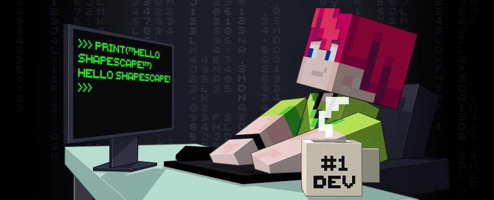

# Shapescape Easy Glyphs
Shapescape Easy Glyphs is a Regolith filter that makes adding custom glyphs easier. 

## 📒 Documentation
Documentation for the filter is available here: https://shapescape-easy-glyphs.readthedocs.io/en/latest/

You can find the documenation for all filters and tools on our organisation page https://github.com/ShapescapeMC.

## 👷 Contributing
We welcome contributions from the community! If you'd like to contribute to this project, please read our [contribute file](github.com/ShapescapeMC/REPO_NAME/CONTRIBUTING.md) for guidelines on how to get started.

## 🗒️ License
This project is licensed under the GNU v.3.0 License - see the [LICENSE](github.com/ShapescapeMC/REPO_NAME/LICENSE) file for details.

This license ensures that the tool remains open source, while still allowing you to use the generated content in your commercial Minecraft projects.

## 📧 Contact
For questions, suggestions, or support, please reach out via mail to contact@shapescape.com